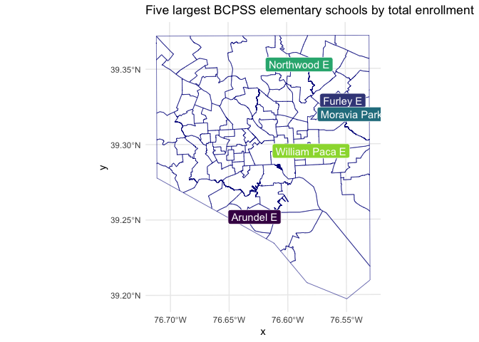

<!-- README.md is generated from README.Rmd. Please edit that file -->

# bcpss

<!-- badges: start -->
<!-- badges: end -->

The goal of bcpss is to make data from the Baltimore City Public School
system more consistent and accessible to R users. This package may pair
well with the [mapbaltimore
package](https://github.com/elipousson/mapbaltimore) that offers a
broader range of Baltimore-specific datasets and functions for working
with that data.

## Installation

You can install the development version from
[GitHub](https://github.com/) with:

``` r
# install.packages("remotes")
remotes::install_github("elipousson/bcpss")
```

## Example

Currently, this package includes datasets that include school and
grade-level enrollment and demographic data, the published results from
a parent survey, and the published results from a combined student and
educator survey completed in 2019. This data can be used to answer
questions, such as, what are the elementary schools with the greatest
total student enrollment?

``` r
library(bcpss)
library(dplyr)
#> 
#> Attaching package: 'dplyr'
#> The following objects are masked from 'package:stats':
#> 
#>     filter, lag
#> The following objects are masked from 'package:base':
#> 
#>     intersect, setdiff, setequal, union

top_5_es <- enrollment_demographics_SY1920 %>% 
  filter(grade_range == "All Grades",
         grade_band == "E") %>% 
  select(school_number, school_name, total_enrollment) %>% 
  top_n(5, total_enrollment) %>% 
  arrange(desc(total_enrollment))

top_5_es %>% 
  knitr::kable(caption = "Five largest BCPSS elementary schools by total enrollment")
```

| school\_number | school\_name                   | total\_enrollment |
|---------------:|:-------------------------------|------------------:|
|            105 | Moravia Park Elementary School |               763 |
|            242 | Northwood Elementary School    |               590 |
|            164 | Arundel Elementary School      |               523 |
|             83 | William Paca Elementary School |               509 |
|            206 | Furley Elementary School       |               495 |

Five largest BCPSS elementary schools by total enrollment

Both the enrollment/demographic data and the parent survey are available
in both a wide and long format.

The package also includes spatial data for elementary school attendance
zones and program locations for the 2020-2021 school year.

``` r
library(ggplot2)

bcps_es_zones_SY2021 %>% 
  ggplot() +
  geom_sf(aes(fill = zone_name)) +
  scale_fill_viridis_d() +
  guides(fill = "none") +
  labs(title = "BCPSS Elementary School Attendance Zones") +
  theme_minimal()
```


These two sources can be used in combinations by joining the
`program_number` in the spatial data with the equivalent `school_number`
used in the survey and demographic data.

``` r
top_5_es_map <- bcps_programs_SY2021 %>% 
  left_join(top_5_es, by = c("program_number" = "school_number")) %>% 
  filter(!is.na(total_enrollment)) %>% 
  ggplot() +
  geom_sf(data = bcps_es_zones_SY2021, fill = NA, color = "darkblue") +
  geom_sf(aes(color = school_name)) +
  geom_sf_label(aes(label = program_name_short, fill = school_name), color = "white") +
  scale_fill_viridis_d(end = 0.7) +
  guides(fill = "none", color = "none") +
  labs(title = "Five largest BCPSS elementary schools by total enrollment") +
  theme_minimal()

top_5_es_map
```



## Related projects

-   [mapbaltimore](https://elipousson.github.io/mapbaltimore/)
-   [baltimoredata](https://elipousson.github.io/baltimoredata/)
-   [EdSurvey](https://www.air.org/project/nces-data-r-project-edsurvey):
    “EdSurvey is an R statistical package designed for the analysis of
    national and international education data from the National Center
    for Education Statistics (NCES).”
-   [edbuildr](https://github.com/EdBuild/edbuildr): “The goal of
    edbuildr is to import EdBuild’s master dataset of school district
    finance, student demographics, and community economic indicators for
    every school district in the United States.”
-   [Elementary School Operating Status + NCES 2019-2020 School District
    Boundaries](https://github.com/hrbrmstr/2021-esos-nces)
-   [CPSenrollpack](https://github.com/cymack/CPSenrollpack): “R package
    of enrollment data for Chicago Public High Schools, 2006-07 to
    2018-19”
